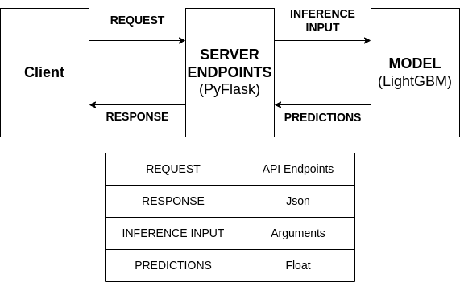

# Demand Sensing Problem

Given a particular date, the application forcasts the sales for the particular day across customer, products, or altogether. The model is trained using data collected between 01-01-2017 and 17-03-2020. Given dates after 01-01-2019, the model forcasts sale for three months of the given test date.

# Train Model

A simple LightGradientBoosting model is trained by extracting time series features on the data provided.

python demand_sense/train.py --model_dir <model-save-directory> --date_file <path-to-data-file> 

To train with hyperparameter optimization using OPTUNA and save the best model:

python demand_sense/train.py --model_dir <model-save-directory> --date_file <path-to-data-file> --hpo

# Validation statistics

3 months data for validation: 

Root Mean squared error (RMSE): 4.96

Mean absolute error (MAE): 1.28

R2 score: 0.36

Explained variance: 0.36

# Inference

python demand_sense/inference.py --model_file <trained-model-path> --date_file <path-to-data-file> --test_date <DDMMYYYY> --infer_level <level-of-inference> --customer_id <customer-id-string> --product_id <product-id-string>

* infer_level [options]: 
    * day (total sales per day) 
    * customer (sales made to a customer on a particular day)
    * product (sales of a product on a particular day)
    * customer_product (sales made to a customer of a product on a particular day)

* infer_level == customer, requires customer_id
* infer_level == product, requires product_id 
* infer_level == customer_product, requires customer_id and product_id

# Launch Server

python demand_sense/app/app.py

# API Endpoints

The available endpoints (example attributes follows ?):
* api/predict?date=29102019
* api/predict_customer_sales?date=29102019&customer_id=1000178
* api/predict_product_sales?date=29102019&product_id=0A4G5LZWCP
* api/predict_customer_product_sales?date=29102019&customer_id=1000178&product_id=0A4G5LZWCP

# Schematics Diagram

# Exploratory Data Analysis

The notebooks inside documents folder includes the EDA carried out.

# Presentations

The presentations are available inside the documents folder.

# References

PyTorch forcasting GitHub examples and Kaggle demand forcasting notebooks

